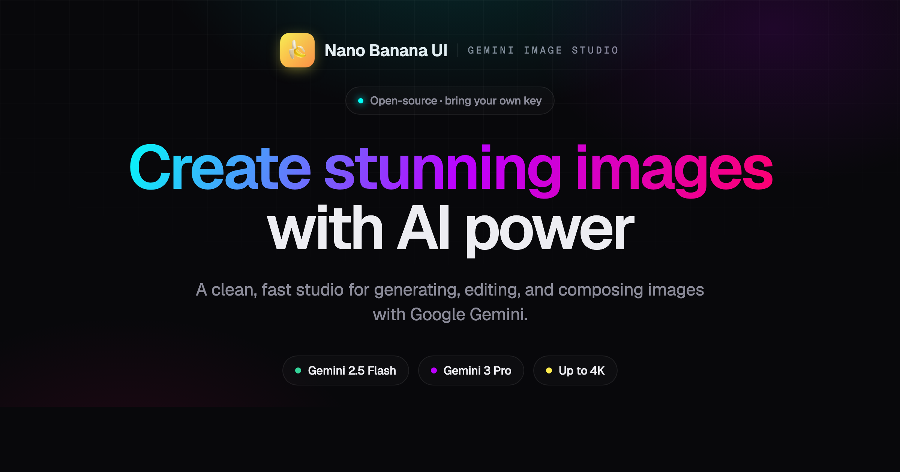

# 🍌 YUV.AI Nano Banana Pro Platform


A stunning, professional-grade web application for generating and editing images using Google's Gemini AI (Nano Banana Pro). Built with Next.js, TypeScript, and Framer Motion for a beautiful, responsive user experience.

## 📸 Screenshots

### Homepage


### Thumbnail Generator


### Viral Generator


## ✨ Features

### 🎨 Image Generation Capabilities

- **Text-to-Image**: Generate stunning images from text descriptions using Gemini 2.5 Flash
- **Image Editing**: Edit existing images with text prompts - add, remove, or modify elements
- **Multi-Image Composition**: Combine up to 14 reference images to create new scenes
- **Search-Grounded Generation**: Generate images based on real-time information from Google Search
- **High-Resolution Generation**: Create professional 4K images with Gemini 3 Pro
- **🚀 Social Media Thumbnail Generator**: Create viral-worthy thumbnails with dramatic scenes, bold text, and eye-catching elements

### 🎯 Special Features

- **Secure API Key Management**: Your API key is stored locally in your browser
- **Dynamic Feature Selection**: Choose from 6 different image generation modes
- **Configurable Settings**: Adjust aspect ratio (9:16, 16:9, 1:1, 4:5, etc.) and quality (1K, 2K, 4K)
- **Instant Download**: Download generated images with one click
- **Mobile Responsive**: Beautiful UI that works on all devices
- **Cyber-Creative Design**: Stunning glassmorphism effects with neon accents

## 🚀 Getting Started

### Prerequisites

- Node.js 18+ installed
- A Google AI Studio API key (get it [here](https://aistudio.google. com/apikey))

### Installation

1. Clone the repository:

```bash
git clone https://github.com/hoodini/nano-banana-ui.git
cd nano-banana-ui
```

2. Install dependencies:

```bash
npm install
```

3.  Run the development server:

```bash
npm run dev
```

4. Open [http://localhost:3000](http://localhost:3000) in your browser

5. Enter your Google AI Studio API key when prompted

## 🎨 Usage

### Getting Your API Key

1. Visit [Google AI Studio](https://aistudio.google.com/apikey)
2. Sign in with your Google account
3.  Create a new API key for Gemini
4. Copy and paste it into the app

### Generating Images

1. **Select a Feature**: Choose from text-to-image, image editing, multi-image composition, or special features
2. **Upload Images** (if required): Upload reference images for editing or composition
3.  **Enter Your Prompt**: Describe what you want to generate
4.  **Configure Settings**: Adjust aspect ratio and quality
5. **Generate**: Click the generate button and watch the magic happen!
6. **Download**: Download your generated image

### Social Media Thumbnail Generator

The special **Social Media Thumbnail Generator** creates viral-worthy thumbnails automatically:

- Upload a character reference image
- Describe the scene and emotion you want
- The AI automatically adds:
  - Dramatic, shocked facial expressions
  - Big, bold text overlays
  - Arrows and highlighting elements
  - High contrast and saturated colors
  - Professional thumbnail styling

Perfect for YouTube, Instagram, and social media content!

## 🛠️ Tech Stack

- **Framework**: Next.js 15 with App Router
- **Language**: TypeScript
- **Styling**: Tailwind CSS with custom cyber-creative theme
- **Animations**: Framer Motion
- **AI**: Google Generative AI SDK (@google/generative-ai)
- **Icons**: Lucide React

## 🎯 Project Structure

```
nano-banana-ui/
├── app/
│   ├── api/
│   │   └── generate/
│   │       └── route. ts          # API route for image generation
│   ├── globals. css               # Custom cyber-creative theme
│   ├── layout. tsx                # Root layout
│   └── page.tsx                  # Main page
├── components/
│   ├── ApiKeyConfig.tsx          # API key configuration modal
│   ├── FeatureSelector.tsx       # Feature selection grid
│   └── GenerationInterface.tsx   # Image generation interface
├── types/
│   └── index.ts                  # TypeScript type definitions
└── public/                       # Static assets
```

## 🌈 Design Philosophy

This application features a **Cyber-Creative Studio** aesthetic:

- Dark theme with vibrant neon accents (electric blues, cyber purples, banana yellows)
- Glassmorphism effects for depth and modern feel
- Bold, geometric typography with Orbitron and Syne fonts
- Smooth animations and micro-interactions
- Professional yet playful vibe

## 📝 API Documentation

The app uses the Google Gemini API for image generation. Check out the [official API docs](https://ai.google. dev/gemini-api/docs/image-generation) for more details.

### Supported Models

- **gemini-2.5-flash-image**: Fast generation for text-to-image and basic editing
- **gemini-3-pro-image-preview**: Advanced features with 4K support, multi-image, and search grounding

## 🔒 Security

- API keys are stored in browser localStorage
- Keys are never sent to any server except Google's Gemini API
- No backend storage of user data or images
- All generation happens securely through Next.js API routes

## 🤝 Contributing

Contributions are welcome! Feel free to:

- Report bugs
- Suggest new features
- Submit pull requests
- Improve documentation

## 👨‍💻 Creator

**Yuval Avidani**
- 🌐 Website: [yuv.ai](https://yuv.ai)
- 🐦 Twitter: [@yuvalav](https://x.com/yuvalav)
- 📸 Instagram: [@yuval_770](https://instagram.com/yuval_770)
- 🔗 LinkTree: [linktr.ee/yuvai](https://linktr.ee/yuvai)

Founder of YUV.AI - Building the future of AI-powered creativity.

## 📄 License

This project is open source and available under the MIT License.

## 🙏 Acknowledgments

- Google Gemini team for the amazing AI models
- Vercel for Next.js
- The open-source community

---

Made with 💜 by [Yuval Avidani](https://yuv.ai)

**Star ⭐ this repo if you find it useful!**
