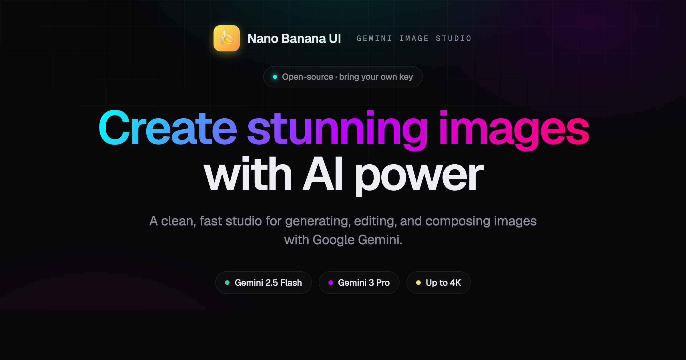

# 🍌 Nano Banana UI


A multi-engine AI image studio for generating and editing images. Built on [Yuval Avidani's YUV.AI Nano Banana Pro Platform](https://github.com/hoodini/nano-banana-ui), extended with free FLUX engines, a redesigned UI, and a pluggable engine layer.

## ✨ Features

### 🎨 Six Generation Modes

- **Text to Image** — photorealistic scenes from text
- **AI Image Editing** — transform uploaded images with prompts
- **Multi-Image Composition** — combine up to 14 reference images
- **Real-Time Search Visualization** — images grounded in live Google Search data
- **Viral Thumbnail Generator** — scroll-stopping social media thumbnails
- **Style Transfer** — apply artistic styles from reference images

### ⚡ Three Image Engines

| Engine | Model | Cost | Credentials | Best for |
|--------|-------|------|-------------|----------|
| **Google Gemini** | `gemini-3-pro-image-preview` | Paid (API usage) | Google AI Studio API key | All six modes — editing, multi-image, search grounding, 4K |
| **Pollinations · FLUX** | FLUX via `image.pollinations.ai` | Free | None | Text-to-image only, no key required |
| **Cloudflare · FLUX** | `@cf/black-forest-labs/flux-1-schnell` | Free daily tier | Cloudflare Account ID + API token | Text-to-image only |

Engines are selected per session via clickable pills in the feature header. Features that need uploaded images, Google Search grounding, or advanced controls automatically fall back to Gemini.

### 🎯 Studio Features

- **API connections dialog** — manage Gemini and Cloudflare credentials in one place (stored in browser `localStorage`)
- **Per-image cost estimate** — shown under the Generate button for Gemini runs
- **Full-screen lightbox** — preview generated images before download
- **AI-generated example prompts** — one-click "Gen Example" with a meta-prompt tooltip
- **AI download filenames** — filenames derived from your prompt
- **Deep-linkable views** — URL-synced feature state (`?feature=text-to-image`)
- **Command palette** — `⌘K` to jump between modes
- **Configurable settings** — aspect ratio and quality (1K / 2K / 4K) where the active engine supports them

## 🚀 Getting Started

### Prerequisites

- Node.js 18+
- **For Gemini modes**: a [Google AI Studio API key](https://aistudio.google.com/apikey)
- **For Cloudflare FLUX** (optional): a [Cloudflare Workers AI token](https://dash.cloudflare.com/?to=/:account/ai/workers-ai) and Account ID

Pollinations requires no credentials.

### Installation

```bash
git clone https://github.com/vmyazin/nano-banana-ui.git
cd nano-banana-ui
npm install
npm run dev
```

Open [http://localhost:3000](http://localhost:3000), connect your API credentials, pick a feature, choose an engine, and generate.

## 🎨 Usage

### Connecting Providers

1. Click **API connections** in the header
2. **Google Gemini** — paste your AI Studio key (validated on save)
3. **Cloudflare Workers AI** — enter Account ID and API token (saved immediately)

### Generating Images

1. **Select a feature** from the landing grid (or `⌘K`)
2. **Choose an engine** — Gemini for full capability; Pollinations or Cloudflare for free text-to-image
3. **Upload images** if the mode requires them (Gemini only)
4. **Enter a prompt** — or click **Gen Example** for an AI-suggested starting point
5. **Adjust settings** — aspect ratio, quality, Google Search (Gemini only)
6. **Generate** — preview in the lightbox, then download

## 🛠️ Tech Stack

- **Framework**: Next.js 16 (App Router)
- **Language**: TypeScript
- **Styling**: Tailwind CSS 4 — Geist typography, hairline borders, restrained neon accents
- **State**: Zustand (persisted API credentials + engine choice)
- **Data fetching**: TanStack Query
- **URL state**: nuqs
- **UI polish**: Framer Motion, Sonner toasts, cmdk command palette
- **AI SDKs**: `@google/genai` (Gemini), fetch adapters for Pollinations and Cloudflare

## 🎯 Project Structure

```
nano-banana-ui/
├── app/
│   ├── api/
│   │   ├── generate/route.ts     # Engine dispatcher (gemini | pollinations | cloudflare)
│   │   ├── example/route.ts      # AI example-prompt generation
│   │   └── slug/route.ts         # AI download filename generation
│   ├── globals.css
│   ├── layout.tsx
│   ├── page.tsx
│   └── providers.tsx
├── components/
│   ├── ApiKeyConfig.tsx          # Unified API connections dialog
│   ├── CommandPalette.tsx
│   ├── FeatureSelector.tsx
│   └── GenerationInterface.tsx
├── lib/
│   ├── engines/
│   │   ├── registry.ts           # Engine metadata + per-feature capability gating
│   │   ├── gemini.ts
│   │   ├── pollinations.ts
│   │   └── cloudflare.ts
│   └── example-prompts.ts
├── store/
│   └── useAppStore.ts            # Persisted credentials + engine preference
└── types/
    └── index.ts
```

## 📝 API & Models

- [Google Gemini Image Generation docs](https://ai.google.dev/gemini-api/docs/image-generation)
- **Gemini**: `gemini-3-pro-image-preview` — all modes, aspect ratio, 1K/2K/4K, Google Search tool
- **Pollinations**: `image.pollinations.ai` — FLUX text-to-image, aspect-ratio mapping, no auth
- **Cloudflare**: Workers AI `flux-1-schnell` — fixed output size, 8 inference steps

## 🔒 Security

- API keys and Cloudflare credentials are stored in browser `localStorage` only
- Credentials are sent to the respective provider APIs through Next.js API routes
- No backend storage of user data or generated images

## 🤝 Contributing

Contributions welcome — report bugs, suggest features, or open pull requests.

## 👨‍💻 Maintainer

**Vasily Myazin** — [GitHub @vmyazin](https://github.com/vmyazin)

## 📄 License

MIT License.

## 🙏 Acknowledgments

- [Yuval Avidani](https://yuv.ai) — original YUV.AI Nano Banana Pro Platform
- [Pollinations](https://pollinations.ai) — free FLUX image API
- Cloudflare Workers AI — free-tier FLUX.1 schnell
- Google Gemini team, Vercel / Next.js, and the open-source community

---


**Star ⭐ this repo if you find it useful!**

Enahanced with 💜 by [Vasily Simon](https://github.com/vmyazin)
