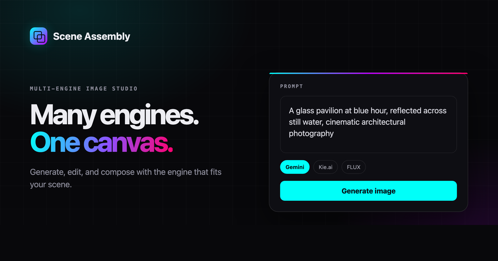

# Scene Assembly

[](https://sceneassembly.mzork.com)


An open-source, multi-engine studio for generating, editing, and composing images—and creating video—with Google Gemini, fal.ai, Kie.ai, Pollinations FLUX, and Cloudflare Workers AI. Bring your own provider credentials and choose the engine that fits the job. Guest credentials are stored in the browser; an optional Google account service can encrypt saved connections and keep jobs, media, and spend history in Cloudflare.

> **Scene Assembly was formerly called Nano Banana UI.** The repository URL retains the former slug during the transition; the product itself is provider-neutral.

## ✨ Features

### 🎨 Six Generation Modes

- **Text to Image** — photorealistic scenes from text
- **AI Image Editing** — transform uploaded images with prompts
- **Multi-Image Composition** — combine up to 14 reference images
- **Real-Time Search Visualization** — images grounded in live Google Search data
- **Viral Thumbnail Generator** — scroll-stopping social media thumbnails
- **Style Transfer** — apply artistic styles from reference images

### ⚡ Five Media Providers

| Engine | Model | Cost | Credentials | Best for |
|--------|-------|------|-------------|----------|
| **Google Gemini** | `gemini-3-pro-image-preview` | Paid (API usage) | Google AI Studio API key | All six modes — editing, multi-image, search grounding, 4K |
| **Pollinations · FLUX** | FLUX via `image.pollinations.ai` | Free | None | Text-to-image only, no key required |
| **Cloudflare · FLUX** | `@cf/black-forest-labs/flux-1-schnell` | Free daily tier | Cloudflare Account ID + API token | Text-to-image only |
| **fal.ai** | Nano Banana 2 + 9 curated video models | fal credits | fal API key | All six image modes plus text-to-video, image-to-video, and first-and-last-frame |
| **Kie.ai** | 15 verified image/video model families | Kie credits | Kie API key | Image generation/editing plus text-to-video and image-to-video |

Image engines are selected via clickable pills in the feature header. fal.ai runs [Nano Banana 2](https://fal.ai/docs/model-api-reference/image-generation-api/nano-banana-2) for all six image modes, including optional web grounding, editing, and composition with up to 14 references. Kie and fal video models use compatible, searchable pickers with only their supported controls exposed.

### 🎬 Kie & fal.ai Image and Video

The header includes URL-synced **Image** and **Video** workspaces. The Video workspace supports text-to-video, image-to-video, and — on fal.ai — first-and-last-frame; use `?workspace=video` for a shareable deep link, `?workspace=video&videoMode=image` to open image-to-video directly, and `?workspace=video&videoMode=frames` for first-and-last-frame.

Kie’s in-app catalog intentionally covers these flagship families:

- **Image (8):** Nano Banana Pro, Nano Banana 2, GPT Image 2, FLUX.2 Pro, Seedream 5 Pro, Imagen 4 Ultra, Ideogram V3, Z-Image
- **Video (7):** Veo 3.1, Kling 3.0, Seedance 2, Wan 2.7, Hailuo 2.3 Pro, Grok Imagine, PixVerse V6

fal.ai has a separate, static catalog of exactly nine curated and verified video choices: **Veo 3.1 Standard**, **Veo 3.1 Fast**, **Seedance 2.0 Standard**, **Seedance 2.0 Fast**, **Kling 3 Standard**, **Kling 3 Pro**, **MiniMax Hailuo 2.3 Standard**, **MiniMax Hailuo 2.3 Pro**, and **Wan 2.7**. Each supports text-to-video and image-to-video.

Seven of them also take **two source images** — a first and a last frame — and generate the motion between them. Veo 3.1 Standard and Fast run this on fal's dedicated `first-last-frame-to-video` endpoints; Seedance 2.0 (both tiers), Kling 3 (both tiers), and Wan 2.7 accept a closing frame alongside the opening one on their image-to-video endpoints. Only the two MiniMax Hailuo 2.3 models are opening-frame only, so they drop out of the picker in this mode.

Browser-only execution for both providers creates tab-local, in-memory jobs. For fal, the app uses the [asynchronous queue](https://fal.ai/docs/documentation/model-apis/inference/queue) to submit, check status, retrieve results, and cancel. Polling stops at success/failure or after 15 minutes; the app never auto-resubmits, and job history is not restored after a reload. Download completed media promptly because provider URLs are temporary.

### 🎯 Studio Features

- **API connections dialog** — manage Gemini, fal, Kie, and Cloudflare credentials in one place (stored in browser `localStorage`)
- **Optional cloud account** — when the separate service is configured, dedicated Google-first `/sign-in` and `/sign-up` pages can save encrypted connections, background jobs, a private 1 GB library, and a separate account spend ledger. Signing in never uploads browser keys or library files; each import is explicit and preserves the browser original
- **Spend page** — every finished generation is recorded in your browser with its cost, labelled exact or estimated, and rolled up by provider, model, and day at `/spend`. Runware reports exact costs; Gemini is priced from its token usage; fal and Kie are estimated from their pricing and credit-balance endpoints; free engines record as free
- **Full-screen lightbox** — preview generated images before download
- **AI-generated example prompts** — one-click "Gen Example" with a meta-prompt tooltip
- **AI download filenames** — filenames derived from your prompt
- **Cheap helper tasks** — filenames and example prompts run on Llama 3.1 8B via Hugging Face when the deployment provides a token, falling back to your Gemini key, then to a plain slugifier
- **Library** — generated images are kept automatically in your browser and survive a reload; videos are listed instantly and kept on request. Reuse any result as a reference image or restore the prompt and settings it ran with
- **Saved prompts** — everything you submit is remembered, and starring keeps the good ones
- **Deep-linkable views** — URL-synced feature state (`?feature=text-to-image`)
- **Command palette** — `⌘K` to jump between modes
- **Configurable settings** — aspect ratio and quality (1K / 2K / 4K) where the active engine supports them
- **Kie and fal job status** — actionable errors for invalid keys, credits, rate limits, policy/validation failures, provider errors, and timeouts

## 🚀 Getting Started

### Prerequisites

- Node.js 24+ (the account-service tests use the built-in `node:sqlite`)
- pnpm 10.32+ (enabled through Corepack)
- **For Gemini modes**: a [Google AI Studio API key](https://aistudio.google.com/apikey)
- **For Cloudflare FLUX** (optional): a [Cloudflare Workers AI token](https://dash.cloudflare.com/?to=/:account/ai/workers-ai) and Account ID
- **For fal image/video** (optional): a [fal API key](https://fal.ai/dashboard/keys)
- **For Kie image/video** (optional): a [Kie API key](https://kie.ai/)

Pollinations requires no credentials.

#### Optional: the shared micro-AI tier

Small helper tasks — deriving a download filename from your prompt, writing an
example prompt — do not need a frontier model. Set `HF_TOKEN` to a
[Hugging Face token](https://huggingface.co/settings/tokens) with Inference
permissions and they run on `Llama-3.1-8B-Instruct` (~$0.02 / 1M input tokens)
instead of consuming your Gemini quota:

```bash
cp .env.example .env.local   # then fill in HF_TOKEN
```

This app-owned credential stays server-side and is never exposed to the client.
Guest provider keys remain in the browser; when the optional account service is
enabled, provider keys a signed-in user explicitly saves are encrypted by that
service. There is **no rate limit or
usage cap** — if you deploy publicly, the token is spent on behalf of every
anonymous visitor. Per-request token counts and an estimated session cost are
shown in the Connections panel.

Leave `HF_TOKEN` unset and each helper task falls back to your Gemini key, then
to a deterministic regex slugifier. Nothing breaks either way.

### Installation

```bash
git clone https://github.com/vmyazin/nano-banana-ui.git scene-assembly
cd scene-assembly
corepack enable
pnpm install
pnpm dev
```

Open [http://localhost:3000](http://localhost:3000), connect your API credentials, pick a feature, choose an engine, and generate.

## 🎨 Usage

### Connecting Providers

1. Click **API connections** in the header
2. **Google Gemini** — paste your AI Studio key (validated on save)
3. **fal.ai** — create an API-scoped key in the [fal dashboard](https://fal.ai/docs/documentation/setting-up/authentication), then paste it; the app validates it with fal’s authenticated pricing endpoint before save
4. **Kie.ai** — paste your Kie key; it is validated against your Kie credit endpoint before save
5. **Cloudflare Workers AI** — enter Account ID and API token (saved immediately)

Guest provider credentials, including the fal key, persist in this browser’s `localStorage`. They are not synced between browsers or devices; clear the saved connection when using a shared computer. If the optional account service is enabled, a signed-in user can separately save an encrypted account connection or explicitly import a browser key. Imports use an if-absent write, so they do not overwrite a connection already saved from another device, and the browser copy remains intact.

### Generating Images

1. **Select a feature** from the landing grid (or `⌘K`)
2. **Choose an engine** — Gemini or fal for all six modes; Pollinations or Cloudflare for free text-to-image
3. **Upload images** if the mode requires them
4. **Enter a prompt** — or click **Gen Example** for an AI-suggested starting point
5. **Adjust settings** — aspect ratio, quality, and web grounding (available for Gemini and fal)
6. **Generate** — preview in the lightbox, then download

### Generating Video with Kie

1. Select **Video** in the header (or open `?workspace=video`)
2. Choose **Text to video** or **Image to video**
3. Connect a Kie key, select a compatible model, and set its available controls
4. For image-to-video, upload the required reference image(s)
5. Start generation and keep the tab open while the temporary Kie task is polled
6. Preview the result with native video controls and download it before its Kie URL expires

### Generating Video with fal.ai

1. Select **Video** in the header, switch the provider to **fal.ai**, and choose text-to-video, image-to-video, or first & last frame
2. Connect a fal key and select one of the nine curated models (seven in first-and-last-frame mode)
3. Add reference images when required, adjust the model-specific controls, and submit
   - In first-and-last-frame mode, pick two stills in order — opening then closing — and use **Swap first and last** if they land the wrong way round
4. Keep the tab open while the app polls the fal queue; you can cancel an active job from its job card
5. Preview and download the result before its temporary fal CDN URL expires

fal inference submissions send `X-Fal-Store-IO: 0`, which opts the JSON request/response payload out of fal history; it does **not** prevent media storage. Uploaded references are configured to expire after one day, and generated outputs after seven days. Both are served from publicly accessible temporary [fal CDN](https://fal.ai/docs/documentation/model-apis/fal-cdn) URLs, so anyone with a URL can access it until expiration—download results promptly and avoid sensitive media.

## 🛠️ Tech Stack

- **Framework**: Next.js 16 (App Router)
- **Language**: TypeScript
- **Styling**: Tailwind CSS 4 — Geist typography, hairline borders, restrained neon accents
- **State**: Zustand (persisted provider credentials/model choices + non-persisted Kie and fal job queues)
- **Data fetching**: TanStack Query
- **URL state**: nuqs
- **UI polish**: Framer Motion, Sonner toasts, cmdk command palette
- **Providers**: `@google/genai` (Gemini), `@fal-ai/client` (fal), and fetch adapters for Kie, Pollinations, and Cloudflare
- **Tests**: Vitest + React Testing Library

## 🎯 Project Structure

```
scene-assembly/
├── app/
│   ├── api/
│   │   ├── generate/route.ts     # Image engine dispatcher
│   │   ├── fal/                  # fal key validation, uploads, and queue lifecycle routes
│   │   ├── kie/                  # Kie credit validation and temporary-file upload routes
│   │   ├── example/route.ts      # AI example-prompt generation
│   │   └── slug/route.ts         # AI download filename generation
│   ├── globals.css
│   ├── layout.tsx
│   ├── page.tsx
│   └── providers.tsx
├── components/
│   ├── ApiKeyConfig.tsx          # Unified API connections dialog
│   ├── CommandPalette.tsx
│   ├── FeatureSelector.tsx
│   └── GenerationInterface.tsx
├── lib/
│   ├── engines/
│   │   ├── registry.ts           # Engine metadata + per-feature capability gating
│   │   ├── gemini.ts
│   │   ├── pollinations.ts
│   │   └── cloudflare.ts
│   ├── fal/                      # Typed catalog, SDK adapter, browser transport, queue helpers
│   ├── kie/                      # Typed catalog, Kie protocols, transport, queue helpers
│   └── example-prompts.ts
├── store/
│   ├── useAppStore.ts            # Persisted credentials + model preferences
│   ├── useFalJobsStore.ts        # Tab-local fal job queue (not persisted)
│   └── useKieJobsStore.ts        # Tab-local Kie task queue (not persisted)
└── types/
    └── index.ts
```

## 📝 API & Models

- [Google Gemini Image Generation docs](https://ai.google.dev/gemini-api/docs/image-generation)
- **Gemini**: `gemini-3-pro-image-preview` — all modes, aspect ratio, 1K/2K/4K, Google Search tool
- **Pollinations**: `image.pollinations.ai` — FLUX text-to-image, aspect-ratio mapping, no auth
- **Cloudflare**: Workers AI `flux-1-schnell` — fixed output size, 8 inference steps
- **fal.ai**: Nano Banana 2 for all six image modes plus nine curated video choices. The `lib/fal` adapter uses fal’s [async queue](https://fal.ai/docs/documentation/model-apis/inference/queue), [CDN](https://fal.ai/docs/documentation/model-apis/fal-cdn), and authenticated [pricing API](https://fal.ai/docs/documentation/model-apis/pricing) for key validation.
- **Kie.ai**: static typed catalog of 15 flagship image/video families; marketplace tasks use Kie’s unified task endpoint while Veo 3.1 uses Kie’s dedicated Veo protocol. See the [Kie catalog](https://docs.kie.ai/llms.txt), [task lifecycle](https://docs.kie.ai/market/common/get-task-detail), and [file upload API](https://docs.kie.ai/file-upload-api/quickstart).

## 🔒 Security

- Guest API keys and provider credentials are stored in browser `localStorage`. Active guest requests may send them through the app's Next.js provider routes, which proxy the request without persisting the key
- `HF_TOKEN` is app-owned and server-side. Account connections are a separate opt-in path: provider keys are encrypted in D1 with versioned AES keys, and account reads return masked metadata rather than plaintext
- Micro-AI prompts keep a static system message and pass user text as a separate `user` message, instructed to treat it as content rather than instructions; every completion is pattern-validated before use, and anything that fails falls back rather than reaching the UI
- Guest requests that require a server proxy send the active credential through a Next.js provider route; account background jobs resolve the encrypted connection inside the Worker
- Guest fal keys are not logged or persisted server-side; each active guest request supplies its own key. A separately saved account key follows the encrypted account-connection path
- fal request payload history is disabled, while uploaded references and generated outputs remain on fal’s public CDN for their configured one-day and seven-day retention periods
- Guest Kie keys are not logged or persisted server-side; only the active guest request uses them. A separately saved account key follows the encrypted account-connection path
- Guest jobs and generated media are stored **locally in your own browser** via IndexedDB; saved prompts live in `localStorage`. Both stay in that browser profile until you clear them — use **Library → Clear library** on a shared machine
- When the optional account service is enabled, signed-in background jobs run through a Cloudflare Workflow and save private media to R2. The cloud library and account spend ledger are separate from the browser library and browser ledger
- Cloud account support is implemented but is not enabled on the production site yet. All eight background-provider flags default off until each provider has passed a credentialed production-like check; no real provider calls or production OAuth/resource setup have been completed

## ✅ Verification

```bash
pnpm test
pnpm lint
pnpm build
```

## 🚢 Deployment

The live demo runs on Vercel and redeploys on every push to `main`. Server-side
timeline rendering and the optional Cloudflare account service are currently
off in production, so guest use is unchanged. See
[`docs/deployment.md`](docs/deployment.md) for the deployment boundary and the
account-service launch checklist.

## 🤝 Contributing

Contributions welcome — report bugs, suggest features, or open pull requests.

## 👨‍💻 Maintainer

**Vasily Simon** — [GitHub @vmyazin](https://github.com/vmyazin)

## 📄 License

MIT License.

## 🙏 Acknowledgments

- [Yuval Avidani](https://yuv.ai) — creator of the original Nano Banana UI that Scene Assembly evolved from
- [Pollinations](https://pollinations.ai) — free FLUX image API
- Cloudflare Workers AI — free-tier FLUX.1 schnell
- [fal.ai](https://fal.ai/) — Nano Banana 2 and curated video model APIs
- Google Gemini team, Vercel / Next.js, and the open-source community

---

Last reviewed: August 4, 2026.

**Star ⭐ this repo if you find it useful!**

Maintained with 💜 by [Vasily Simon](https://github.com/vmyazin)
